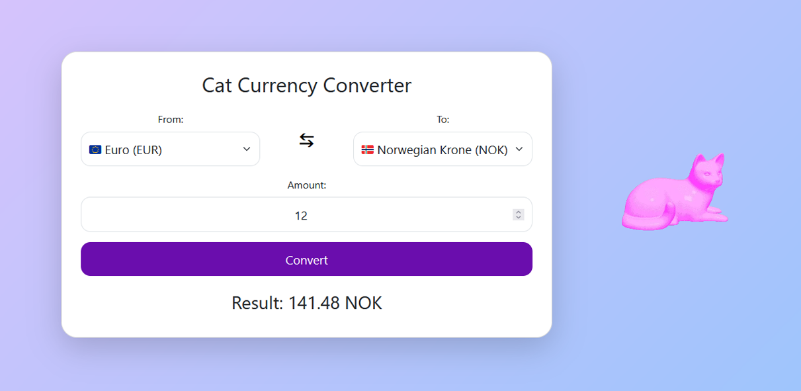

# 🐱 Cat Currency Converter
### https://oaf131.github.io/cat-currency-converter

Cat Currency Converter is a fun and interactive currency converter featuring a cute rotating cat GIF! It allows users to convert between multiple currencies in a stylish and responsive design!



## 🚀 Features
- Convert between **EUR, USD, GBP, PLN, SEK, and NOK**.
- **Swap currencies** instantly with a single click.
- **Real-time exchange rates** from an API.
- **Responsive design** with mobile-friendly adjustments.

## 📂 Project Structure
```
CatCurrencyConverter/
│── index.html  (HTML structure)
│── styles.css  (CSS styling)
│── script.js   (JavaScript logic)
```

## 🎨 Technologies Used
- **HTML5, CSS3, JavaScript**
- **Bootstrap** for styling
- **Exchange Rate API** for fetching real-time currency rates
- **Responsive Design** for mobile support

## Contact
- 📧 Email: [konstantin.webdev.01@gmail.com](mailto:konstantin.webdev.01@gmail.com)
